# End-to-End Image Retrieval Service with K8s & Jenkins
## System Architecture
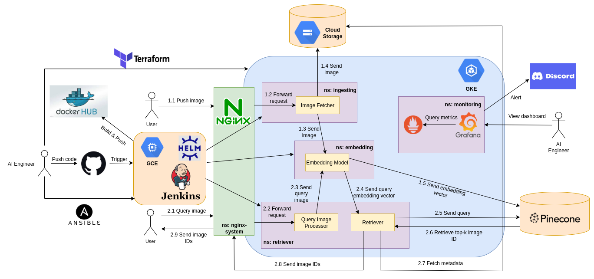
## Technology:
* Source control: [![Git/Github][Github-logo]][Github-url]
* CI/CD: [![Jenkins][Jenkins-logo]][Jenkins-url]
* Build API: [![FastAPI][FastAPI-logo]][FastAPI-url]
* Containerize application: [![Docker][Docker-logo]][Docker-url]
* Container orchestration system: [![Kubernetes(K8s)][Kubernetes-logo]][Kubernetes-url]
* K8s's package manager: [![Helm][Helm-logo]][Helm-url]
* Data Storage for images: [![Google Cloud Storage][Google-Cloud-Storage-logo]][Google-Cloud-Storage-url]
* Data Storage for vector embeddings: [![Pinecone][Pinecone-logo]][Pinecone-url]
* Event trigger: [![Cloud Pub/Sub][Cloud-Pub-Sub-logo]][Cloud-Pub-Sub-url]
* Ingress controller: [![Nginx][Nginx-logo]][Nginx-url]
* Observable tools: [![Prometheus][Prometheus-logo]][Prometheus-url] [![Loki][Loki-logo]][Loki-url] [![Grafana][Grafana-logo]][Grafana-url] [![Jaeger][Jaeger-logo]][Jaeger-url]
* Deliver infrastructure as code: [![Ansible][Ansible-logo]][Ansible-url] [![Terraform][Terraform-logo]][Terraform-url]
* Cloud platform: [![GCP][GCP-logo]][GCP-url]
## Project Structure
```txt
  ├── ansible                               
  │    ├── playbook
  |    |    ├── create_compute_instance.yaml
  |    |    └── install_and_run_docker.yml
  │    ├── inventory                   
  │    └── requirements.txt
  ├── embedding                               
  │    ├── Dockerfile                    
  │    ├── main.py                      
  │    └── requirements.txt
  ├── gifs
  ├── helm_charts                 
  │    ├── embedding
  |    |    ├── templates
  |    |    |    ├── deployment.yaml
  |    |    |    └── service.yaml
  |    |    ├── Chart.yaml
  |    |    └── values.yaml
  │    ├── ingesting
  |    |    ├── templates
  |    |    |    ├── deployment.yaml
  |    |    |    ├── nginx-ingress.yaml
  |    |    |    └── service.yaml
  |    |    ├── Chart.yaml
  |    |    └── values.yaml
  │    ├── nginx-ingress
  │    └── retriever
  |    |    ├── templates
  |    |    |    ├── deployment.yaml
  |    |    |    ├── nginx-ingress.yaml
  |    |    |    └── service.yaml
  |    |    ├── Chart.yaml
  |    |    └── values.yaml
  ├── images                            
  ├── ingesting                              
  │    ├── .env                       
  │    ├── config.py                
  │    ├── Dockerfile                             
  │    ├── main.py                      
  │    └── requirements.txt                          
  ├── retriever                             
  │    ├── .env                       
  │    ├── config.py                
  │    ├── Dockerfile                  
  │    ├── main.py                     
  │    └── requirements.txt                         
  ├── terraform
  │    ├── main.tf
  │    └── variables.tf
  ├── Dockerfile-jenkins
  └── Jenkinsfile         
```
# Table of contents

1. [Create GKE Cluster](#1-create-gke-cluster)
2. [Deploy serving service manually](#2-deploy-serving-service-manually)

    1. [Deploy nginx ingress controller](#21-deploy-nginx-ingress-controller)

    2. [Deploy the Embedding Model](#22-deploy-the-embedding-model)

    3. [Deploy the Ingesting](#22-deploy-the-ingesting)

    4. [Deploy the Retriever](#22-deploy-the-retriever)

3. [Deploy monitoring service](#3-deploy-monitoring-service)

    1. [Deploy Prometheus service](#31-deploy-prometheus-service)

    2. [Deploy Grafana service](#32-deploy-grafana-service)


4. [Continuous deployment to GKE using Jenkins pipeline](#4-continuous-deployment-to-gke-using-jenkins-pipeline)

    1. [Spin up your instance](#41-spin-up-your-instance)

    2. [Install Docker and Jenkins in GCE](#42-install-docker-and-jenkins)

    3. [Connect to Jenkins UI in Compute Engine](#43-connect-to-jenkins-ui-in-compute-engine)

    4. [Setup Jenkins](#44-setup-jenkins)

5. [Demo](#5-demo)

    1. [Demo ingest data](#51-demo-ingest-data)

    2. [Demo retriever](#52-demo-retriever)

## 1. Create GKE Cluster

### 1.1. Create [Project](https://console.cloud.google.com/projectcreate) in Google Cloud Platform (GCP)
### 1.2. Install gcloud CLI 
Gcloud CLI can be installed following this document https://cloud.google.com/sdk/docs/install#deb

### 1.3. Install gke-cloud-auth-plugin
```bash
sudo apt-get install google-cloud-cli-gke-gcloud-auth-plugin
```

### 1.4. Using [terraform](https://developer.hashicorp.com/terraform/tutorials/aws-get-started/install-cli) to create GKE cluster.
Update <your_project_id> in `terraform/variables.tf`. Run the following commands to create GKE cluster:
```bash
cd terraform
terraform init
terraform plan
terraform apply
```
+ GKE cluster is deployed at **asia-southeast1** with its one node machine type is: **"e2-standard-4"**  (4 vCPUs, 16 GB RAM and costs $396.51/month).
+ Unable [Autopilot](https://cloud.google.com/kubernetes-engine/docs/concepts/autopilot-overview) for the GKE cluster. When using Autopilot cluster, certain features of Standard GKE are not available, such as scraping node metrics from Prometheus service.

It can takes about 10 minutes for create successfully a GKE cluster. You can see that on [GKE UI](https://console.cloud.google.com/kubernetes/list)

### 1.5. Connect to the GKE cluster.
+ Go back to the [GKE UI](https://console.cloud.google.com/kubernetes/list).
+ Click on your cluster and select **Connect**.
+ Copy the line `gcloud container clusters get-credentials ...` into your local terminal.

After run this command, the GKE cluster can be connected from local.
```bash
kubectx
```
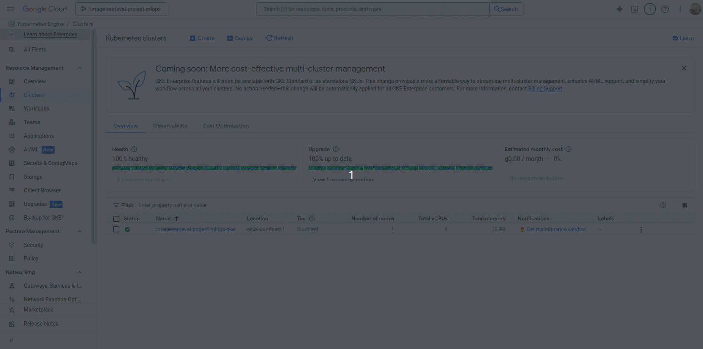
## 2. Deploy serving service manually
Using [Helm chart](https://helm.sh/docs/topics/charts/) to deploy application on GKE cluster.

### 2.1. Deploy nginx ingress controller
```bash
helm upgrade --install nginx-ingress ./helm_charts/nginx-ingress --namespace nginx-system --create-namespace
```
After that, nginx ingress controller will be created in `nginx-ingress` namespace.
+ Check if the nginx-ingress controller pods are running successfully:
```bash
kubectl get pods -n nginx-system
```
+ Ensure that the required services are created by Helm for the nginx-ingress controller:
```bash
kubectl get svc -n nginx-system
```
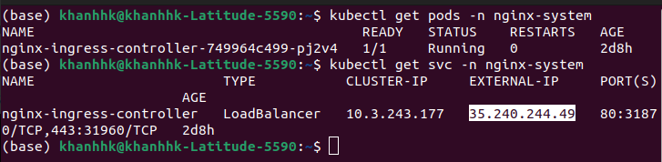
### 2.2. Deploy the Embedding Model
Tôi sử dụng mô hình embedding là [ViT-MSN][https://github.com/facebookresearch/msn], có thể import thông qua [Hugging Face][https://huggingface.co/facebook/vit-msn-base]. Run the following bash command to deploy it on Kubernetes:
```bash
helm upgrade --install embedding-service ./helm_charts/embedding --namespace embedding --create-namespace
```
After executing this command, several pods for the embedding model will be created in the ```embedding``` namespace
### 2.3. Deploy the Ingesting
Before running the Helm install command, you must edit the host of the ingress in ./helm_charts/ingesting/values.yaml, to use the external-ip of the NGINX service mentioned above and append nip.io to expose the IP publicly. For example, in my case:
```bash
ingress:
  enabled: true
  host: 35.240.244.49.nip.io
```
To deploy the ingesting, run the following bash command:
```bash
kubectl create namespace ingesting
kubectl create secret generic ingesting-secrets --from-literal=PINECONE_APIKEY=<your_pinecone_apikey> --namespace ingesting
kubectl create secret generic gcp-key-secret --from-file=gcp-key.json=<path_to_the_file_json> --namespace ingesting
helm upgrade --install ingesting-service ./helm_charts/ingesting --namespace ingesting
```
After executing this command, several pods for the ingesting will be created in the ```ingesting``` namespace
Now you can access ingesting at address: http://35.240.244.49.nip.io/ingesting/docs
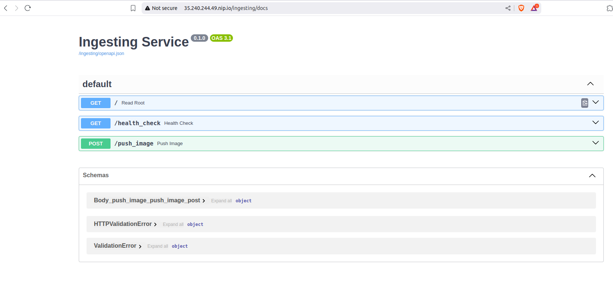
### 2.4. Deploy the Retriever
Similar to the Ingesting, you need to edit the host of the ingress in ./helm_charts/retriever/values.yaml, using the external-ip of the NGINX service mentioned earlier and appending sslip.io to expose the IP publicly. For example, in my case:
```bash
ingress:
  enabled: true
  host: 35.240.244.49.sslip.io
```
Then, run the following bash command to deploy it on Kubernetes:
```bash
kubectl create namespace retriever
kubectl create secret generic retriever-secrets --from-literal=PINECONE_APIKEY=<your_pinecone_apikey> --namespace retriever
kubectl create secret generic gcp-key-secret --from-file=gcp-key.json=<path_to_the_file_json> --namespace retriever
helm upgrade --install retriever-service ./helm_charts/retriever --namespace retriever
```
Now you can access retriever at address: http://35.240.244.49.sslip.io/retriever/docs
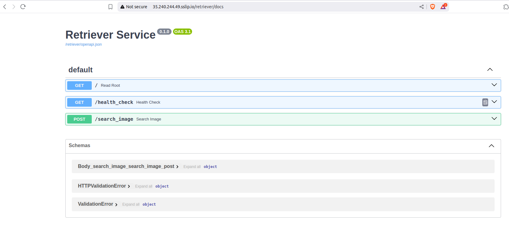

## 3. Deploy monitoring service
I'm using Prometheus and Grafana for monitoring the health of both Node and pods that running application.

Prometheus will scrape metrics from both Node and pods in GKE cluster. Subsequently, Grafana will display information such as CPU and RAM usage for system health monitoring, and system health alerts will be sent to Discord.

### 3.1. Deploy Prometheus service

+ Create Prometheus CRDs
```bash
cd helm_charts/prometheus-operator-crds
kubectl create ns monitoring
kubens monitoring
helm upgrade --install prometheus-crds .
```

+ Deploy Prometheus service (with `NodePort` type) to GKE cluster
```bash
cd helm_charts/prometheus
kubens monitoring
helm upgrade --install prometheus .
```

*Warnings about the health of the node and the pod running the application will be alerted to Discord. In this case, the alert will be triggered and sent to Discord when there is only 10% memory available in the node.*

Prometheus UI can be accessed by `[YOUR_NODEIP_ADDRESS]:30001`

**Note**:
+ Open [Firewall policies](https://console.cloud.google.com/net-security/firewall-manager/firewall-policies) to modify the protocols and ports corresponding to the node `Targets` in a GKE cluster. This will be accept incoming traffic on ports that you specific.
+ I'm using ephemeral IP addresses for the node, and these addresses will automatically change after a 24-hour period. You can change to static IP address for more stability or permanence.


### 3.2. Deploy Grafana service
+ Deploy Grafana service (with `NodePort` type) to GKE cluster

```bash
cd helm_charts/grafana
kubens monitoring
helm upgrade --install grafana .
```

Grafana UI can be accessed by `[YOUR_NODEIP_ADDRESS]:30000` (with both user and password is `admin`)

Add Prometheus connector to Grafana with Prometheus server URL is: `[YOUR_NODEIP_ADDRESS]:30001`.

This is some `PromSQL` that you can use for monitoring the health of node and pod:
+ RAM usage of 2 pods that running application
```shell
container_memory_usage_bytes{container='app', namespace='model-serving'}
```
+ CPU usage of 2 pods that running application
```shell
rate(container_cpu_usage_seconds_total{container='app', namespace='model-serving'}[5m]) * 100
```


+ Node usage
     


## 4. Continuous deployment to GKE using Jenkins pipeline
Jenkins is deployed on Google Compute Engine using [Ansible](https://docs.ansible.com/ansible/latest/playbook_guide/playbooks_intro.html) with a machine type is **e2-standard-2**.

### 4.1. Spin up your instance
Create new key as json type for your [service account](https://console.cloud.google.com/) and save it in `ansible/secrets` directory. Update your `project` and `service_account_file` in `ansible/playbook/create_compute_instance.yaml`.

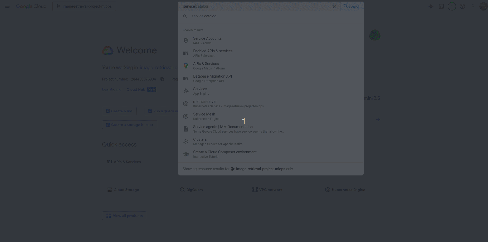

Go back to your terminal, please execute the following commands to create the Compute Engine instance:
```bash
cd ansible/play-book
ansible-playbook create_compute_instance.yaml
```

Go to Settings, select [Metadata](https://console.cloud.google.com/compute/metadata) and add your SSH key.
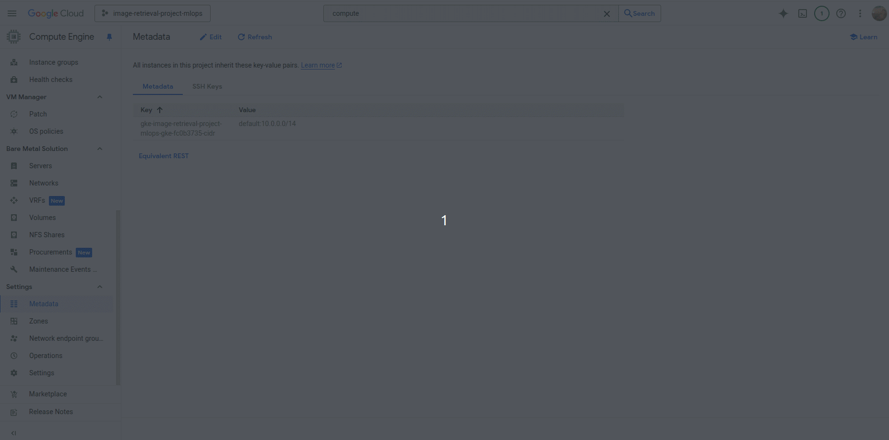
### 4.2. Install Docker and Jenkins in GCE
Update the IP address of the newly created instance and the SSH key for connecting to the Compute Engine in the inventory file.
```bash
cd ansible/playbook
ansible-playbook -i ../inventory install_and_run_docker.yml
```

### 4.3. Connect to Jenkins UI in Compute Engine
Access the instance using the command:
```bash
ssh -i ~/.ssh/id_rsa YOUR_USERNAME@YOUR_EXTERNAL_IP
```
Check if jenkins container is already running ?
```bash
sudo docker ps
```
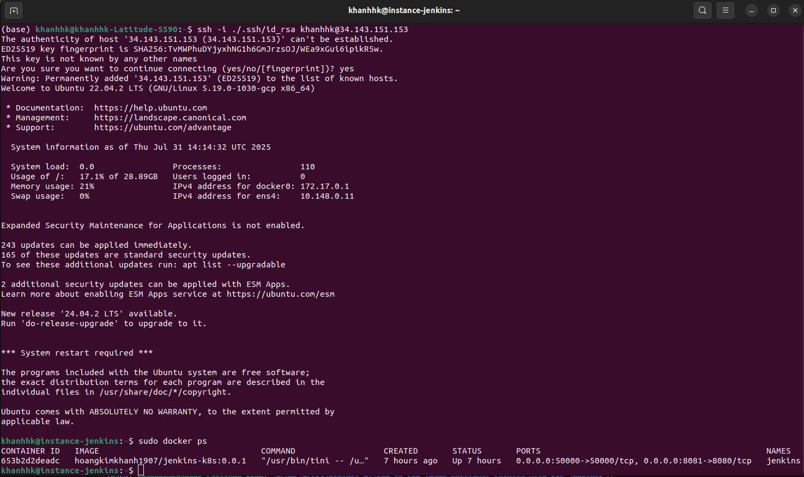
Open web brower and type `[YOUR_EXTERNAL_IP]:8081` for access Jenkins UI. To Unlock Jenkins, please execute the following commands:
```shell
sudo docker exec -ti jenkins bash
cat /var/jenkins_home/secrets/initialAdminPassword
```
Copy the password and you can access Jenkins UI.

It will take a few minutes for Jenkins to be set up successfully on their Compute Engine instance.

### 4.4. Setup Jenkins
After the installation is complete, run the following commands:
```shell
kubectl create clusterrolebinding <your_name_space>-admin-binding \
  --clusterrole=admin \
  --serviceaccount=<your_name_space>:default \
  --namespace=<your_name_space>

kubectl create clusterrolebinding anonymous-admin-binding \
  --clusterrole=admin \
  --user=system:anonymous \
  --namespace=<your_name_space>
```
Install the Kubernetes, Docker, Docker Pineline, GCloud SDK Plugins at Manage Jenkins/Plugins
After successful installation, restart the Jenkins container in your Compute Engine instance:
```shell
sudo docker restart jenkins
```
#### 4.4.1. Connecting with K8s cluster at `Manage Jenkins/Clouds`.
Mở terminal chạy lệnh sau để tìm địa chỉ file config:
```shell
echo $KUBECONFIG
```
Nếu không thấy gì thì chay:
```shell
cat ~/.kube/config
```
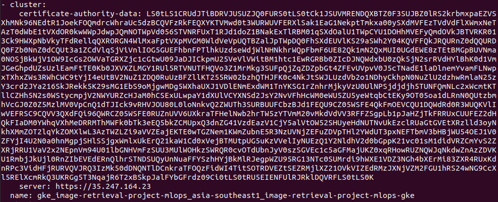

Copy server và certificate-authority-data, paste tương ứng vào Kubernetes URL và Kubernetes server certificate key.

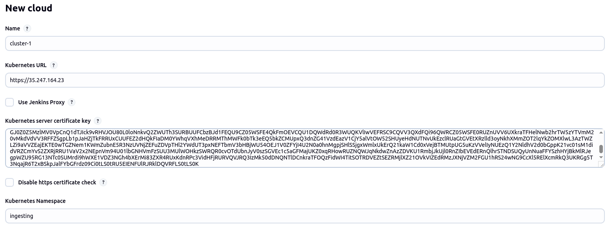

Test Connection -> Connected to Kubernetes v1.33.2-gke.1111000

#### 4.4.2. Add Dockerhub credential to Jenkins at `Manage Jenkins/Credentials`
Điền Username chính là username ở dockerhub. Để điền password thì ta vào Account Settings --> Personal access tokens --> Generate new token
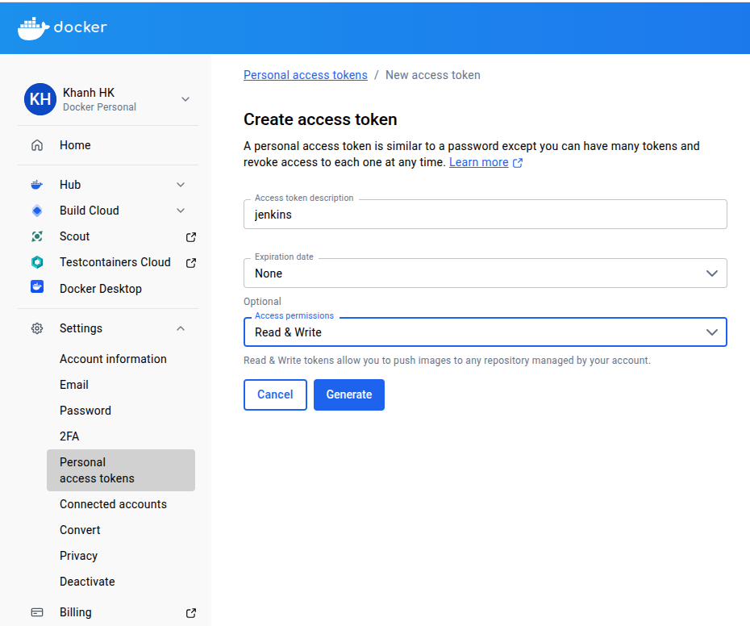
Ấn Generate, sau đó copy personal access token và paste vào Password. Cuối cùng là ID, điền dockerhub
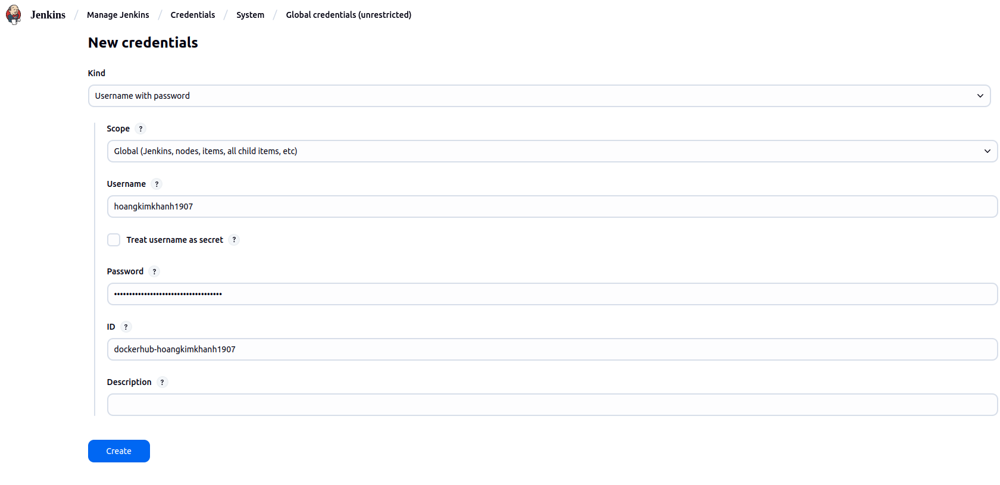

Config Github API usage rate limiting strategy at `Manage Jenkins/System`
Change strategy into: Never check rate limie
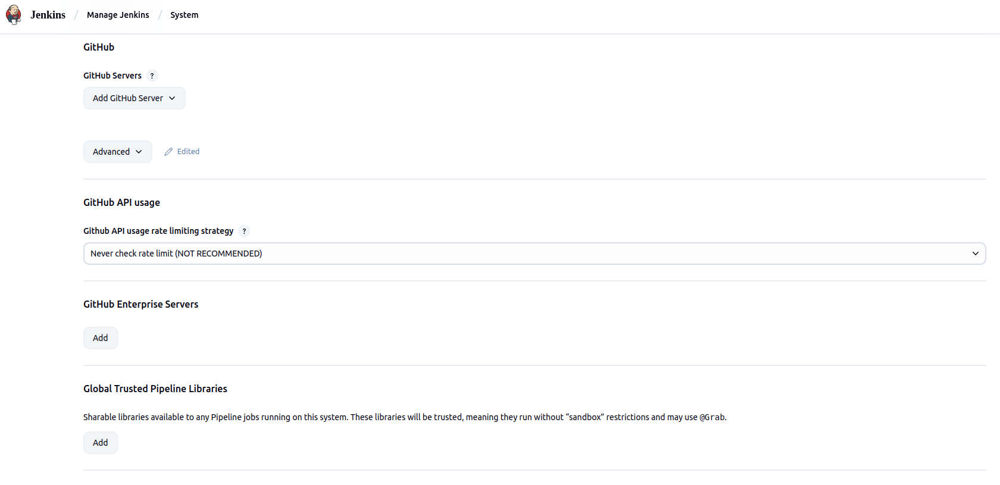
#### 4.4.3. Connect to Github repo
+ Add Jenkins url to webhooks in Github repo
Chọn Settings --> Webhooks
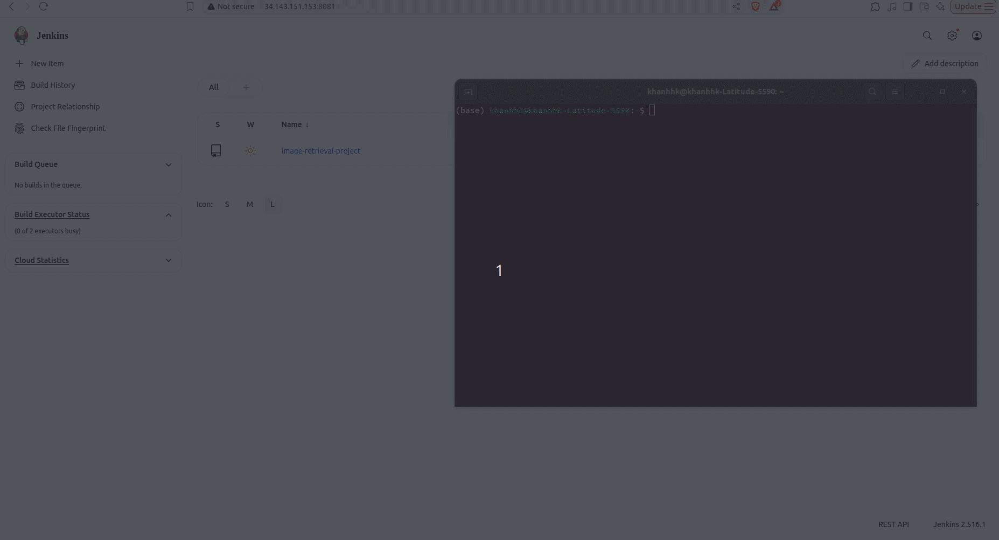

+ Create Item and Connect Jenkins to GitHub

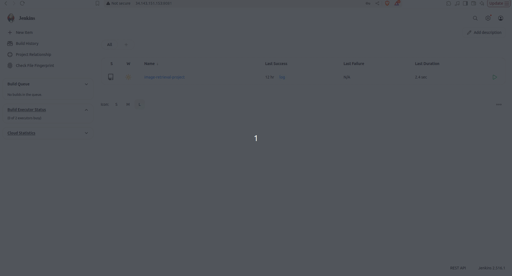

When the build is complete, you will see the following:
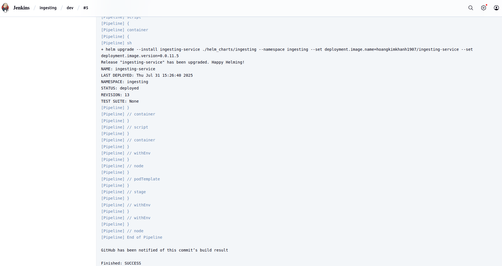

## 5. Demo

### 5.1 Demo ingest data


### 5.2 Demo retriever


<!-- MARKDOWN LINKS & IMAGES -->
[Github-logo]: https://img.shields.io/badge/GitHub-181717?logo=github&logoColor=white
[Github-url]: https://github.com/

[Jenkins-logo]: https://img.shields.io/badge/Jenkins-ff6600?logo=jenkins&logoColor=white
[Jenkins-url]: https://www.jenkins.io/

[FastAPI-logo]: https://img.shields.io/badge/FastAPI-009688?logo=fastapi&logoColor=white
[FastAPI-url]: https://fastapi.tiangolo.com/

[Docker-logo]: https://img.shields.io/badge/Docker-2496ED?logo=docker&logoColor=white
[Docker-url]: https://www.docker.com/

[Kubernetes-logo]: https://img.shields.io/badge/Kubernetes-326CE5?logo=kubernetes&logoColor=white
[Kubernetes-url]: https://kubernetes.io/

[Helm-logo]: https://img.shields.io/badge/Helm-0F1689?logo=helm&logoColor=white
[Helm-url]: https://helm.sh/

[Google-Cloud-Storage-logo]: https://img.shields.io/badge/Google_Cloud_Storage-4285F4?logo=google-cloud&logoColor=white
[Google-Cloud-Storage-url]: https://cloud.google.com/storage

[Pinecone-logo]: https://img.shields.io/badge/Pinecone-4A90E2?logo=pinecone&logoColor=white
[Pinecone-url]: https://www.pinecone.io

[Cloud-Pub-Sub-logo]: https://img.shields.io/badge/Cloud_Pub/Sub-4285F4?logo=google-cloud&logoColor=white
[Cloud-Pub-Sub-url]: https://cloud.google.com/pubsub

[Google-Cloud-Functions-logo]: https://img.shields.io/badge/Google_Cloud_Functions-4285F4?logo=google-cloud&logoColor=white
[Google-Cloud-Functions-url]: https://cloud.google.com/functions

[Nginx-logo]: https://img.shields.io/badge/Nginx-009639?logo=nginx&logoColor=white
[Nginx-url]: https://docs.nginx.com/nginx-ingress-controller/

[Prometheus-logo]: https://img.shields.io/badge/Prometheus-E6522C?logo=prometheus&logoColor=white
[Prometheus-url]: https://prometheus.io/

[Loki-logo]: https://img.shields.io/badge/Loki-FA7A58?logo=grafana&logoColor=white
[Loki-url]: https://grafana.com/oss/loki/

[Grafana-logo]: https://img.shields.io/badge/Grafana-009C84?logo=grafana&logoColor=white
[Grafana-url]: https://grafana.com/

[Jaeger-logo]: https://img.shields.io/badge/Jaeger-5E8E88?logo=jaeger&logoColor=white
[Jaeger-url]: https://www.jaegertracing.io/

[Ansible-logo]: https://img.shields.io/badge/Ansible-3A3A3A?logo=ansible&logoColor=white
[Ansible-url]: https://www.ansible.com/

[Terraform-logo]: https://img.shields.io/badge/Terraform-7A4D8C?logo=terraform&logoColor=white
[Terraform-url]: https://www.terraform.io/

[GCP-logo]: https://img.shields.io/badge/Google_Cloud_Platform-4285F4?logo=google-cloud&logoColor=white
[GCP-url]: https://cloud.google.com/
