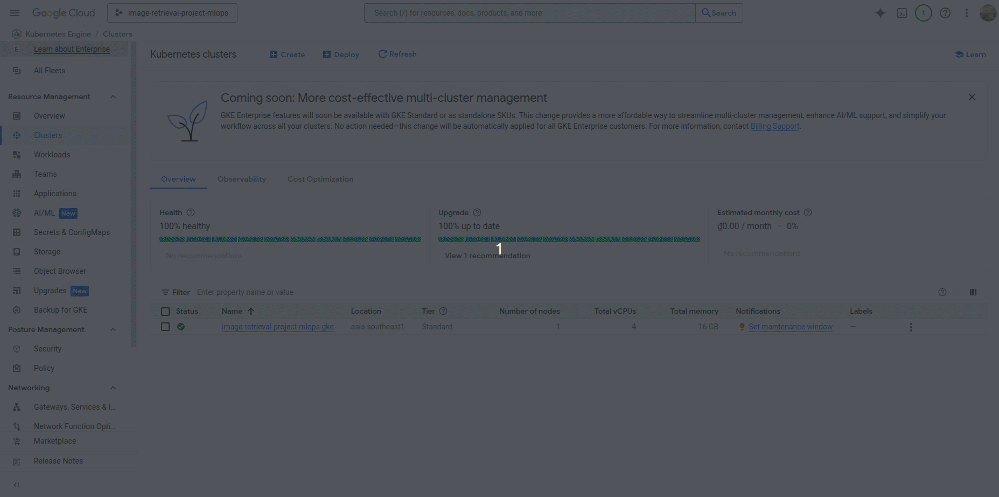

# Image-Retrieval-ML-System-on-K8S
## System Architecture

## Technology:
* Source control: [![Git/Github][Github-logo]][Github-url]
* CI/CD: [![Jenkins][Jenkins-logo]][Jenkins-url]
* Build API: [![FastAPI][FastAPI-logo]][FastAPI-url]
* Containerize application: [![Docker][Docker-logo]][Docker-url]
* Container orchestration system: [![Kubernetes(K8s)][Kubernetes-logo]][Kubernetes-url]
* K8s's package manager: [![Helm][Helm-logo]][Helm-url]
* Data Storage for images: [![Google Cloud Storage][Google-Cloud-Storage-logo]][Google-Cloud-Storage-url]
* Data Storage for vector embeddings: [![Pinecone][Pinecone-logo]][Pinecone-url]
* Ingress controller: [![Nginx][Nginx-logo]][Nginx-url]
* Observable tools: [![Prometheus][Prometheus-logo]][Prometheus-url] [![Elasticsearch][Elasticsearch-logo]][Elasticsearch-url] [![Grafana][Grafana-logo]][Grafana-url] [![Jaeger][Jaeger-logo]][Jaeger-url] [![Kibana][Kibana-logo]][Kibana-url]
* Deliver infrastructure as code: [![Ansible][Ansible-logo]][Ansible-url] [![Terraform][Terraform-logo]][Terraform-url]
* Cloud platform: [![GCP][GCP-logo]][GCP-url]
## Project Structure
```txt
  ├── ansible                               
  │    ├── playbook
  │    └──  inventory    
  ├── custom_jenkins                              
  │    └──  Dockerfile              
  ├── embedding                               
  │    ├── Dockerfile                    
  │    ├── main.py                      
  │    └── requirements.txt
  ├── gifs
  ├── helm_charts
  │    ├── elk        
  │    ├── embedding
  │    ├── grafana
  │    ├── ingesting
  │    ├── jaeger-all-in-one
  │    ├── nginx-ingress
  │    ├── prometheus
  │    ├── prometheus-operator-crds
  │    └── retriever
  ├── images                            
  ├── ingesting                              
  │    ├── .env                       
  │    ├── config.py                
  │    ├── Dockerfile                             
  │    ├── main.py
  │    ├── requirements.txt                  
  │    └── utils.py
  ├── local                              
  │    ├── alertmanager                     
  │    ├── elk          
  │    ├── grafana                            
  │    ├── instrument
  │    ├── prometheus                  
  │    └── prom-graf-docker-compose.yaml                      
  ├── retriever                             
  │    ├── .env                       
  │    ├── config.py                
  │    ├── Dockerfile                  
  │    ├── main.py
  │    ├── requirements.txt                   
  │    └── utils.py              
  ├── terraform
  │    ├── main.tf
  │    └── variables.tf
  ├── tests                                           
  │    ├── test_embedding.py         
  │    ├── test_image.jpeg                            
  │    ├── test_ingesting.py                
  │    └── test_retriever.py
  ├── Jenkinsfile
  └── requirements.txt       
```

# Table of contents

1. [Create GKE Cluster](#1-create-gke-cluster)
2. [Deploy serving service manually](#2-deploy-serving-service-manually)

    1. [Deploy nginx ingress controller](#21-deploy-nginx-ingress-controller)

    2. [Deploy the Embedding Model](#22-deploy-the-embedding-model)

    3. [Deploy the Ingesting](#23-deploy-the-ingesting)

    4. [Deploy the Retriever](#24-deploy-the-retriever)

3. [Deploy monitoring services](#3-deploy-monitoring-services)

    1. [Deploy Prometheus](#31-deploy-prometheus)

    2. [Deploy Grafana](#32-deploy-grafana)

    3. [Deploy Jaeger](#33-deploy-jaeger)

    4. [Deploy ELK Stack](#34-deploy-elk-stack)


4. [Continuous deployment to GKE using Jenkins pipeline](#4-continuous-deployment-to-gke-using-jenkins-pipeline)

    1. [Provision GCE Instance](#41-provision-gce-instance)

    2. [Install Docker & Jenkins in GCE](#42-install-docker-&-jenkins-in-gce)

    3. [Access Jenkins UI](#43-access-jenkins-ui)

    4. [Configure Jenkins for GKE Integration](#44-configure-jenkins-for-gke-integration)

5. [Demo](#5-demo)

    1. [Demo ingest data](#51-demo-ingest-data)

    2. [Demo retriever](#52-demo-retriever)

## 1. Create GKE Cluster

### 1.1. Create a [Project](https://console.cloud.google.com/projectcreate) in Google Cloud Platform (GCP)
Start by creating a new project on Google Cloud Platform.
### 1.2. Install the Google Cloud CLI
Follow the instructions in the https://cloud.google.com/sdk/docs/install#deb to install the gcloud CLI on your local machine.

### 1.3. Install gke-cloud-auth-plugin
Install the GKE-specific authentication plugin with the following command:
```bash
sudo apt-get install google-cloud-cli-gke-gcloud-auth-plugin
```

### 1.4. Using [terraform](https://developer.hashicorp.com/terraform/tutorials/aws-get-started/install-cli) to create GKE cluster
Update the value of <your_project_id> in `terraform/variables.tf`. Then run the following commands to initialize and apply the Terraform configuration:
```bash
cd terraform
terraform init
terraform plan
terraform apply
```
+ The GKE cluster will be deployed in the **asia-southeast1** region.
+ Each node will use the machine type **e2-standard-4** (4 vCPUs, 16 GB RAM, approx. $396.51/month).
+ The cluster is configured in **Standard mode**, not **Autopilot**. Autopilot mode is not recommended in this setup because it restricts certain functionalities such as Prometheus-based node metrics scraping.

Provisioning may take up to 10 minutes. You can monitor the cluster status via the [GKE Console](https://console.cloud.google.com/kubernetes/list).

### 1.5. Connect to the GKE cluster
+ Go to the [GKE Console](https://console.cloud.google.com/kubernetes/list).
+ Select your cluster and click **Connect**.
+ Copy and run the `gcloud container clusters get-credentials ...` command provided.

Once authenticated, you can verify the connection using:
```bash
kubectx
```

## 2. Deploy serving service manually
Using [Helm chart](https://helm.sh/docs/topics/charts/) to deploy your application components to the GKE cluster.

### 2.1. Deploy nginx ingress controller
Run the following command to install the NGINX Ingress Controller:
```bash
helm upgrade --install nginx-ingress ./helm_charts/nginx-ingress --namespace nginx-system --create-namespace
```
This will create the ingress controller in the `nginx-ingress` namespace.
+ Verify that the ingress controller pods are running:
```bash
kubectl get pods -n nginx-system
```
+ Check that the corresponding services have been created:
```bash
kubectl get svc -n nginx-system
```

### 2.2. Deploy the Embedding Model
I use the [ViT-MSN](https://github.com/facebookresearch/msn) embedding model, which is available via [Hugging Face](https://huggingface.co/facebook/vit-msn-base). To deploy it on Kubernetes, run:
```bash
helm upgrade --install embedding-service ./helm_charts/embedding --namespace embedding --create-namespace
```
This command creates all necessary resources in the `embedding` namespace.
### 2.3. Deploy the Ingesting
Create the Namespace and Secrets:
```bash
kubectl create namespace image-retrieval
kubectl create secret generic image-retrieval-secrets --from-literal=PINECONE_APIKEY=<your_pinecone_apikey> --namespace image-retrieval
kubectl create secret generic gcp-key-secret --from-file=gcp-key.json=<path_to_the_file_json> --namespace image-retrieval
```

Before deploying, update the host value in `./helm_charts/ingesting/values.yaml` to match the external IP of the NGINX service with the `.nip.io` domain. For example:
```bash
ingress: 
  enabled: true
  host: 35.240.244.49.nip.io
```
Then run the following command:
```bash
helm upgrade --install ingesting-service ./helm_charts/ingesting --namespace image-retrieval
```
Once deployed, the ingesting service will be available at: http://35.240.244.49.nip.io/ingesting/docs.


### 2.4. Deploy the Retriever
Similar to the ingesting service, update the host value in `./helm_charts/retriever/values.yaml` to use the external IP with `.sslip.io`. For example:
```bash
ingress:
  enabled: true
  host: 35.240.244.49.sslip.io
```
Then run:
```bash
helm upgrade --install retriever-service ./helm_charts/retriever --namespace image-retrieval
```
Once deployed, the retriever service will be accessible at: http://35.240.244.49.sslip.io/retriever/docs.


## 3. Deploy monitoring services
I'm using Prometheus and Grafana for monitoring the health of both Node and pods that running application.

Prometheus will scrape metrics from both Node and pods in GKE cluster. Subsequently, Grafana will display information such as CPU and RAM usage for system health monitoring, and system health alerts will be sent to Discord.

### 3.1 Deploy Prometheus
Prometheus is responsible for scraping metrics from Kubernetes nodes and pods using exporters such as `node-exporter` and `kube-state-metrics`.

+ Install Prometheus CRDs:
```bash
cd helm_charts/prometheus-operator-crds
kubectl create ns monitoring
kubens monitoring
helm upgrade --install prometheus-crds .
```

+ Deploy Prometheus service (exposed via NodePort):
```bash
cd helm_charts/prometheus
kubens monitoring
helm upgrade --install prometheus .
```

Access Prometheus UI:
+ URL: `[YOUR_NODEIP_ADDRESS]:30001`
+ To retrieve your node's external IP:
  ```bash
  kubectl get nodes -o wide
  ```

### 3.2 Deploy Grafana
Grafana will be used to visualize metrics collected by Prometheus and provide dashboards for system and application health.

Deploy Grafana service (exposed via NodePort):
```bash
cd helm_charts/grafana
kubens monitoring
helm upgrade --install grafana .
```

Access Grafana UI at `[YOUR_NODEIP_ADDRESS]:30000` (with both user and password is `admin`).

**Note**:
+ Make sure that the GCP firewall allows inbound TCP traffic on ports `30001` and `30000` to the relevant GKE node targets.
+ If using ephemeral external IPs, be aware that they may change after 24 hours. For stability, consider reserving a static external IP via the GCP Console or gcloud CLI.


### 3.3 Deploy Jaeger
To deploy the Jaeger all-in-one tracing system to your Kubernetes cluster, run the following Helm command:
```bash
helm upgrade --install jaeger-tracing ./helm_charts/jaeger-all-in-one --namespace tracing --create-namespace
```
To access the Jaeger UI using a custom domain (jaeger.hkk.vn), map the domain to your Ingress Controller's external IP:
+ Open your `/etc/hosts` file with elevated permissions:
```bash
sudo nano /etc/hosts
```
+ Add the following line (replace `35.240.244.49` with your actual Ingress external IP if different):
```bash
35.240.244.49 jaeger.hkk.vn
```
Now, you can open your browser and visit: http://jaeger.hkk.vn.


### 3.4 Deploy ELK Stack
Add Elastic Helm Repository:
```bash
helm repo add elastic https://helm.elastic.co
helm repo update
```

Deploy ELK Components:
+ Elasticsearch: stores and indexes log data.
```bash
helm upgrade --install elasticsearch elastic/elasticsearch -f ./helm_charts/elk/values-elasticsearch.yaml --version 8.5.1 -n logging --create-namespace
```
+ Logstash: processes and transforms log data before sending it to Elasticsearch.
```bash
helm upgrade --install logstash elastic/logstash -f ./helm_charts/elk/values-logstash.yaml --version 8.5.1 -n logging --create-namespace
```
+ Filebeat: collects logs from applications and sends them to Logstash/Elasticsearch.
```bash
helm upgrade --install filebeat elastic/filebeat -f ./helm_charts/elk/values-filebeat.yaml --version 8.5.1 -n logging --create-namespace
```
+ Kibana: web UI for visualizing and exploring data stored in Elasticsearch.
```bash
helm upgrade --install kibana elastic/kibana -f ./helm_charts/elk/values-kibana.yaml --version 8.5.1 -n logging --create-namespace
```

Expose Kibana UI via Ingress because:
+ Kibana communicates with Elasticsearch internally.
+ This avoids exposing Elasticsearch directly, improving security.
```bash
kubectl apply -f ./helm_charts/elk/kibana-ingress.yaml
```
Access Kibana at: `http://kibana.35.240.244.49.nip.io` and login with password in `values-elasticsearch.yaml` or get by this command:
```bash
kubectl get secrets --namespace=logging elasticsearch-master-credentials -ojsonpath='{.data.password}' | base64 -d
```


## 4. Continuous deployment to GKE using Jenkins pipeline
Jenkins is deployed on a Google Compute Engine (GCE) instance using [Ansible](https://docs.ansible.com/ansible/latest/playbook_guide/playbooks_intro.html). The instance is configured with the machine type: **e2-standard-2** (2 vCPUs, 8 GB RAM).

### 4.1. Provision GCE Instance
+ Create a new service account key (in JSON format) via the Google Cloud Console.
+ Save it to the `ansible/secrets` directory.
+ Open `ansible/playbook/create_compute_instance.yaml` and update the `project` and `service_account_file`.


Then, run the following command to create a new Compute Engine instance:
```bash
cd ansible/playbook
ansible-playbook create_compute_instance.yaml
```

After the instance is created, go to [GCE Metadata Settings](https://console.cloud.google.com/compute/metadata) and add your local SSH public key.


### 4.2. Install Docker & Jenkins in GCE
Update the instance's external IP and SSH key path in the `inventory` file. Then, run:
```bash
cd ansible/playbook
ansible-playbook -i ../inventory install_and_run_docker.yml
```
This will install Docker and run Jenkins as a container.

### 4.3. Access Jenkins UI
SSH into your GCE instance:
```bash
ssh -i ~/.ssh/id_rsa YOUR_USERNAME@YOUR_EXTERNAL_IP
```

Verify that the Jenkins container is running:
```bash
sudo docker ps
```


Open your browser and navigate to: `[YOUR_EXTERNAL_IP]:8081`. To unlock Jenkins during the first setup, run:
```bash
sudo docker exec -ti jenkins bash
cat /var/jenkins_home/secrets/initialAdminPassword
```
Copy the password and paste it into the Jenkins UI to proceed. It may take a few minutes for Jenkins to finish initializing.

### 4.4. Configure Jenkins for GKE Integration
Create the necessary `ClusterRoleBinding` to allow Jenkins to communicate with your GKE cluster:
```bash
kubectl create clusterrolebinding <your_name_space>-admin-binding \
  --clusterrole=admin \
  --serviceaccount=<your_name_space>:default \
  --namespace=<your_name_space>

kubectl create clusterrolebinding anonymous-admin-binding \
  --clusterrole=admin \
  --user=system:anonymous \
  --namespace=<your_name_space>
```
Install the following plugins via `Manage Jenkins/Plugins`:
+ Kubernetes.
+ Docker.
+ Docker Pineline.
+ GCloud SDK Plugins.

Then restart the Jenkins container:
```bash
sudo docker restart jenkins
```
#### 4.4.1. Connect Jenkins to GKE
Go to `Manage Jenkins/Clouds` and configure your Kubernetes cluster connection.


#### 4.4.2. Add DockerHub Credentials
Go to `Manage Jenkins/Credentials` and add your DockerHub username and password.


Configure the GitHub API usage rate limiting strategy at `Manage Jenkins/System` by setting it to "Never check rate limit."

#### 4.4.3. Configure GitHub Integration
+ Go to your GitHub repository and add your Jenkins webhook:


+ In Jenkins, create a new item (pipeline job) and connect it to your GitHub repo.


After a successful build, you should see something like:


## 5. Demo

### 5.1 Demo ingest data


### 5.2 Demo retriever


<!-- MARKDOWN LINKS & IMAGES -->
[Github-logo]: https://img.shields.io/badge/GitHub-181717?logo=github&logoColor=white
[Github-url]: https://github.com/

[Jenkins-logo]: https://img.shields.io/badge/Jenkins-ff6600?logo=jenkins&logoColor=white
[Jenkins-url]: https://www.jenkins.io/

[FastAPI-logo]: https://img.shields.io/badge/FastAPI-009688?logo=fastapi&logoColor=white
[FastAPI-url]: https://fastapi.tiangolo.com/

[Docker-logo]: https://img.shields.io/badge/Docker-2496ED?logo=docker&logoColor=white
[Docker-url]: https://www.docker.com/

[Kubernetes-logo]: https://img.shields.io/badge/Kubernetes-326CE5?logo=kubernetes&logoColor=white
[Kubernetes-url]: https://kubernetes.io/

[Helm-logo]: https://img.shields.io/badge/Helm-0F1689?logo=helm&logoColor=white
[Helm-url]: https://helm.sh/

[Google-Cloud-Storage-logo]: https://img.shields.io/badge/Google_Cloud_Storage-4285F4?logo=google-cloud&logoColor=white
[Google-Cloud-Storage-url]: https://cloud.google.com/storage

[Pinecone-logo]: https://img.shields.io/badge/Pinecone-4A90E2?logo=pinecone&logoColor=white
[Pinecone-url]: https://www.pinecone.io

[Google-Cloud-Functions-logo]: https://img.shields.io/badge/Google_Cloud_Functions-4285F4?logo=google-cloud&logoColor=white
[Google-Cloud-Functions-url]: https://cloud.google.com/functions

[Nginx-logo]: https://img.shields.io/badge/Nginx-009639?logo=nginx&logoColor=white
[Nginx-url]: https://docs.nginx.com/nginx-ingress-controller/

[Prometheus-logo]: https://img.shields.io/badge/Prometheus-E6522C?logo=prometheus&logoColor=white
[Prometheus-url]: https://prometheus.io/

[Elasticsearch-logo]: https://img.shields.io/badge/Elasticsearch-005571?logo=elasticsearch&logoColor=white
[Elasticsearch-url]: https://www.elastic.co/elasticsearch

[Kibana-logo]: https://img.shields.io/badge/Kibana-00BFB3?logo=kibana&logoColor=white
[Kibana-url]: https://www.elastic.co/kibana

[Grafana-logo]: https://img.shields.io/badge/Grafana-009C84?logo=grafana&logoColor=white
[Grafana-url]: https://grafana.com/

[Jaeger-logo]: https://img.shields.io/badge/Jaeger-5E8E88?logo=jaeger&logoColor=white
[Jaeger-url]: https://www.jaegertracing.io/

[Ansible-logo]: https://img.shields.io/badge/Ansible-3A3A3A?logo=ansible&logoColor=white
[Ansible-url]: https://www.ansible.com/

[Terraform-logo]: https://img.shields.io/badge/Terraform-7A4D8C?logo=terraform&logoColor=white
[Terraform-url]: https://www.terraform.io/

[GCP-logo]: https://img.shields.io/badge/Google_Cloud_Platform-4285F4?logo=google-cloud&logoColor=white
[GCP-url]: https://cloud.google.com/
